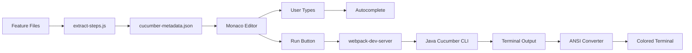

# Monaco Gherkin Editor

A production-ready, project-agnostic Gherkin editor built with Monaco Editor and Java Cucumber integration. Features per-scenario log isolation, ANSI color rendering, and intelligent autocomplete powered by real feature file examples.

  

## ✨ Features

- **🎯 Per-Scenario Isolation**: Execute and view logs for individual scenarios via dropdown selector
- **🎨 ANSI Color Rendering**: Full Cucumber color output preserved using `ansi_up`
- **🔍 Smart Autocomplete**: Real step examples extracted from your feature files
- **⚙️ Project-Agnostic**: Configure via `monaco-gherkin.json` - works with any Java Cucumber project
- **📊 Live Execution**: Sequential scenario execution with real-time status updates
- **🏗️ Modular Architecture**: Clean separation of concerns (~300 LOC frontend)

## 🚀 Quick Start

### Prerequisites

- **Node.js** 16+ and npm
- **Java JDK** 17+ (for Cucumber execution)
- **Gradle** (wrapper included in demo)

### Installation

```bash
# Clone the repository
git clone https://github.com/Saksham1970/monaco-gherkin.git
cd monaco-gherkin

# Install dependencies
npm install

# Build the backend demo (optional - for testing)
cd backend-demo
./gradlew build
cd ..

# Extract step definitions and metadata
node scripts/extract-steps.js

# Start the development server
npm run dev
```

The editor will open at `http://localhost:8080`

## 📋 Configuration

Create or modify `monaco-gherkin.json` in the project root:

```json
{
  "jarPath": "path/to/your-project.jar",
  "javaBin": "C:/Program Files/Java/jdk-17/bin/java.exe",
  "gluePackage": "com.your.package.stepdefinitions",
  "featuresPath": "path/to/src/test/resources",
  "defaultFeature": "Feature: Your Default Feature\n\n  Scenario: Example\n    Given a step"
}
```

### Configuration Fields

| Field | Description | Required |
|-------|-------------|----------|
| `jarPath` | Path to your compiled JAR with Cucumber tests | ✅ Yes |
| `javaBin` | Path to Java executable | ✅ Yes |
| `gluePackage` | Package containing step definitions | ✅ Yes |
| `featuresPath` | Directory containing `.feature` files | ⚠️ Recommended |
| `defaultFeature` | Initial content for the editor | ❌ Optional |

## 🎮 Usage

### 1. Extract Metadata

Before using the editor, extract step definitions and examples from your project:

```bash
node scripts/extract-steps.js
```

This generates `src/assets/cucumber-metadata.json` containing:
- Step definitions from Java annotations
- Custom parameter types
- Real step examples from feature files (1 per definition)

### 2. Write Gherkin

Use the Monaco editor with full autocomplete support:

```gherkin
Feature: Coffee Shop Orders

  Scenario: Order a latte
    Given the coffee shop is open
    When I order a Large "Latte" with "Milk, Sugar"
    Then the receipt should show $6.50
```

**Autocomplete triggers:**
- Type `Given`, `When`, `Then` and press `Ctrl+Space`
- Suggestions show real examples from your feature files

### 3. Execute Scenarios

Click **"Run Scenarios"** to:
1. Execute all scenarios sequentially
2. View summary with pass/fail counts
3. Select individual scenarios from dropdown to view isolated logs

### 4. View Results

**Terminal Features:**
- **Run Summary**: Full execution log with all scenarios
- **Scenario Selector**: Dropdown to view individual scenario logs
- **Status Bar**: Real-time pass/fail counts
- **ANSI Colors**: Cucumber's colored output preserved

## 🏗️ Architecture

### Frontend Structure

```
src/
├── components/
│   └── TerminalView.ts      # Terminal UI component (86 LOC)
├── services/
│   └── CucumberRunner.ts    # Backend communication (20 LOC)
├── utils/
│   ├── AnsiConverter.ts     # ANSI-to-HTML conversion (10 LOC)
│   └── GherkinScanner.ts    # Scenario parsing (20 LOC)
├── index.ts                 # Main orchestration (106 LOC)
└── index.html               # UI layout
```

### Backend Bridge

The `/run-cucumber` endpoint is served by **webpack-dev-server** during development:

```javascript
// webpack.config.js
devServer.app.post('/run-cucumber', (req, res) => {
  // 1. Save Gherkin to temp file
  // 2. Execute: java -cp your.jar io.cucumber.core.cli.Main
  // 3. Return stdout/stderr with ANSI colors
  // 4. Cleanup temp file
});
```

**For production**, deploy a proper backend (Node.js/Express, Spring Boot, etc.) that implements this endpoint.

### Data Flow



## 📦 Backend Demo

Included Java Cucumber demo (`backend-demo/`):

```
backend-demo/
├── src/
│   ├── main/java/com/example/coffee/
│   │   ├── CoffeeShop.java
│   │   └── Order.java
│   └── test/
│       ├── java/com/example/coffee/
│       │   ├── StepDefinitions.java
│       │   ├── ParameterTypes.java
│       │   └── RunCucumberTest.java
│       └── resources/com/example/coffee/
│           ├── ordering.feature
│           └── custom_orders.feature
└── build.gradle
```

**Custom Parameter Types:**
- `{isoDate}`: ISO date format (2024-01-15)
- `{money}`: Currency format ($10.00)
- `{size}`: Enum (Small|Medium|Large)

## 🔧 Development

### Build Commands

```bash
# Development server with hot reload
npm run dev

# Production build
npm run build

# Extract metadata from JAR
node scripts/extract-steps.js

# Build backend demo
cd backend-demo && ./gradlew build
```

### Desktop App (Electron)

```bash
# Run in development mode
npm run electron:dev

# Build Windows installer
npm run electron:build
```

### Adding to Your Project

1. **Copy configuration template**:
   ```bash
   cp monaco-gherkin.json.example monaco-gherkin.json
   ```

2. **Update paths** to point to your JAR and Java installation

3. **Extract metadata**:
   ```bash
   node scripts/extract-steps.js
   ```

4. **Start editor**:
   ```bash
   npm run dev
   ```

## 🎯 Key Optimizations

- **Lean Metadata**: Extracts only 1 example per step definition (prevents explosion with 100s of scenarios)
- **Intelligent Matching**: Pairs step definitions with real examples using keyword heuristics
- **Modular Design**: 4 focused modules with single responsibilities
- **Library Integration**: Uses `ansi_up` for robust ANSI parsing (no custom implementation)

## 📝 Example Workflow

1. **Write your Java step definitions**:
   ```java
   @Given("the coffee shop is open")
   public void theCoffeeShopIsOpen() {
       shop = new CoffeeShop();
   }
   ```

2. **Build your JAR**:
   ```bash
   ./gradlew build
   ```

3. **Extract metadata**:
   ```bash
   node scripts/extract-steps.js
   ```

4. **Use the editor** with autocomplete showing your actual steps

5. **Execute scenarios** and view isolated logs per scenario

## 🤝 Contributing

Contributions welcome! Please:
1. Fork the repository
2. Create a feature branch
3. Make your changes
4. Submit a pull request

## 📄 License

MIT License - see LICENSE file for details

## 🙏 Acknowledgments

- [Monaco Editor](https://microsoft.github.io/monaco-editor/) - Microsoft's code editor
- [@cucumber/monaco](https://github.com/cucumber/monaco) - Cucumber language support
- [ansi_up](https://github.com/drudru/ansi_up) - ANSI to HTML conversion
- [Cucumber](https://cucumber.io/) - BDD testing framework

---

**Built with ❤️ for better Gherkin development**
