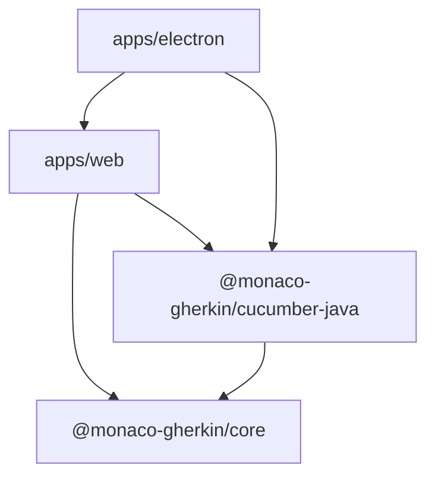
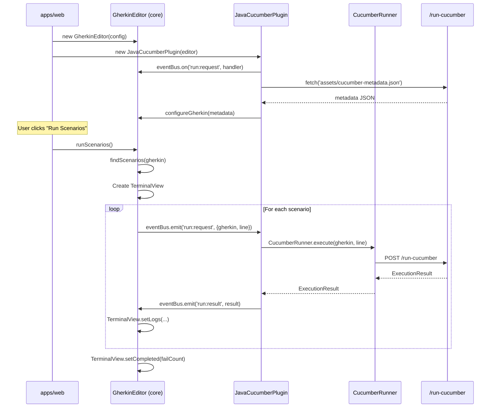

# Monaco Gherkin Editor — Modularization Plan

## 1. Goal

Refactor the monolithic `src/` codebase into a **plugin architecture** with clear separation of responsibilities:

| Package | Purpose |
|---------|---------|
| `packages/gherkin-editor-core` | Framework-agnostic LSP-style Gherkin editor. Accepts step/parameter JSON, emits lifecycle events (`run`, `clear`, etc.), provides plugin-registration API for options. |
| `packages/cucumber-java-plugin` | Java-specific execution backend: runs Cucumber CLI, extracts steps from JARs, manages Java-specific options (`jarPath`, `javaBin`, `gluePackage`, `featuresPath`). Also owns extraction scripts and server-side middleware. |
| `apps/web` | Thin shell that imports core + java plugin, wires them together, and mounts the web UI. |
| `apps/electron` | Electron desktop app — window management, IPC, and internal express server. |

The `backend-demo/` remains unchanged as a sample Java project.

> **This is a design-only change.** The user-facing behaviour must remain identical — no regressions.

---

## 2. Current Architecture (as-is)

```
src/
├── index.ts              # Monolith: editor init, gherkin config, scenario running
├── index.html            # UI layout + all CSS
├── components/
│   └── TerminalView.ts   # Terminal UI for run results
├── services/
│   └── CucumberRunner.ts # HTTP/Electron bridge to Java backend
├── utils/
│   ├── AnsiConverter.ts  # ANSI→HTML via ansi_up
│   └── GherkinScanner.ts # Regex-based scenario parser
└── assets/
    └── cucumber-metadata.json  # Steps + param types (generated)

electron/
├── main.js               # Electron entry (IPC + express server)
├── preload.js            # contextBridge for renderer
├── server.js             # Express server (serves dist + /run-cucumber)
├── cucumber-service.js   # Java CLI execution (Electron variant)
└── cucumber-middleware.js # Java CLI execution (webpack-dev-server variant)

scripts/
├── extract-steps.js      # Extracts steps from JAR (Node.js + child_process)
└── ParameterExtractor.java # Java helper to extract standard parameter types

backend-demo/             # Sample Java Cucumber project (Gradle)
monaco-gherkin.json       # Mixed config (core + Java-specific)
```

### Problems with current design

1. **No separation of concerns** — `index.ts` handles editor creation, gherkin configuration, AND scenario execution orchestration.
2. **Tight coupling to Java** — `CucumberRunner.ts`, `cucumber-middleware.js`, `extract-steps.js` are all Java-specific but live at the same level as the core editor code.
3. **No plugin API** — No way to swap the Java backend for another language's Cucumber implementation.
4. **Config file mixes concerns** — `monaco-gherkin.json` contains both editor config (`defaultFeature`) and backend config (`jarPath`, `javaBin`).
5. **Empty stubs** — `packages/core` and `packages/java-cucumber-plugin` exist but are completely empty (only `node_modules/` symlinks).
6. **Scattered Java tooling** — `scripts/`, `electron/cucumber-middleware.js`, and `electron/cucumber-service.js` are all Java-specific but live in different root-level directories.

---

## 3. Target Architecture (to-be)

```
packages/
├── gherkin-editor-core/                # NPM: @monaco-gherkin/core
│   ├── package.json
│   ├── tsconfig.json
│   └── src/
│       ├── index.ts                    # Public API barrel export
│       ├── GherkinEditor.ts            # Main class: creates Monaco editor, configures Gherkin
│       ├── GherkinEditorOptions.ts     # Options/config types for the editor
│       ├── TerminalView.ts             # Terminal UI component (from src/components/)
│       ├── AnsiConverter.ts            # ANSI→HTML (from src/utils/)
│       ├── GherkinScanner.ts           # Scenario parser (from src/utils/)
│       ├── EventBus.ts                 # Typed event emitter for core↔plugin communication
│       └── types.ts                    # Shared types: CucumberMetadata, ExecutionResult, etc.
│
└── cucumber-java-plugin/               # NPM: @monaco-gherkin/cucumber-java
    ├── package.json
    ├── tsconfig.json
    ├── scripts/                        # ← moved from root scripts/
    │   ├── extract-steps.js            # Extracts steps from JAR
    │   └── ParameterExtractor.java     # Java helper for standard param types
    └── src/
        ├── index.ts                    # Public API barrel export
        ├── JavaCucumberPlugin.ts       # Plugin class implementing core's plugin interface
        ├── CucumberRunner.ts           # HTTP/Electron bridge (from src/services/)
        ├── cucumber-middleware.js      # ← moved from electron/ (server-side, webpack-dev-server)
        ├── cucumber-service.js         # ← moved from electron/ (server-side, Electron variant)
        └── types.ts                    # Java-specific config types

apps/
├── web/
│   ├── package.json
│   ├── tsconfig.json
│   ├── webpack.config.js              # ← moved from root, adjusted paths
│   └── src/
│       ├── index.ts                   # Thin wiring: imports core + plugin, creates editor
│       └── index.html                 # ← moved from src/
│
└── electron/                          # ← moved from root electron/
    ├── main.js                        # Electron entry (IPC + window)
    ├── preload.js                     # contextBridge for renderer
    └── server.js                      # Internal Express server

backend-demo/                           # Unchanged
monaco-gherkin.json                     # Kept at root (read by plugin scripts and services)
```

### Package Dependency Graph



---

## 4. Detailed Design

### 4.1 `packages/gherkin-editor-core`

#### 4.1.1 `types.ts` — Shared Types

```typescript
// Metadata JSON format (what plugins provide to core)
export interface CucumberMetadata {
  parameterTypes?: Array<{ name: string; regex: string }>;
  steps: Array<{ type?: string; expression: string; example: string }>;
}

// Result of executing a scenario
export interface ExecutionResult {
  success: boolean;
  stdout: string;
  stderr: string;
}

// Parsed scenario from editor content
export interface Scenario {
  name: string;
  line: number;
}

// Plugin option that plugins can register with core
export interface PluginOption {
  key: string;
  label: string;
  type: 'string' | 'number' | 'boolean' | 'select';
  defaultValue: unknown;
  choices?: string[];         // for 'select' type
  description?: string;
}
```

#### 4.1.2 `EventBus.ts` — Typed Event Emitter

The core owns a typed event bus. Core emits **requests** that plugins listen to, and plugins emit **responses** that core listens to.

```typescript
// Events emitted BY CORE (plugins listen)
export interface CoreEvents {
  'run:request':      { gherkin: string; line?: number };  // Core asks plugin to execute
  'run:all:request':  { gherkin: string };                 // Core asks plugin to run all scenarios
  'clear':            {};                                   // Clear terminals
}

// Events emitted BY PLUGINS (core listens)
export interface PluginEvents {
  'run:result':       ExecutionResult;                      // Single execution result
  'metadata:loaded':  CucumberMetadata;                     // Plugin provides metadata
  'error':            { message: string };                  // Plugin reports error
}
```

The `EventBus` is a simple typed wrapper around an `EventTarget` or a custom emitter — no external dependency needed.

#### 4.1.3 `GherkinEditor.ts` — Main Class

```typescript
export interface GherkinEditorConfig {
  container: HTMLElement;               // DOM element for editor
  terminalContainer: HTMLElement;       // DOM element for terminals list
  statusElement?: HTMLElement;          // Status text element
  theme?: string;                       // Monaco theme (default: 'vs-dark')
  initialValue?: string;               // Initial editor content
}

export class GherkinEditor {
  private editor: monaco.editor.IStandaloneCodeEditor;
  private eventBus: EventBus;
  private registeredOptions: Map<string, PluginOption[]>;

  constructor(config: GherkinEditorConfig);

  // Plugin management
  getEventBus(): EventBus;
  registerPluginOptions(pluginId: string, options: PluginOption[]): void;
  getPluginOptions(pluginId: string): PluginOption[];

  // Called by plugin after metadata is loaded
  configureGherkin(metadata: CucumberMetadata): void;

  // Called by the run button handler — orchestrates execution via events
  runScenarios(): Promise<void>;

  // Access to the monaco editor
  getEditor(): monaco.editor.IStandaloneCodeEditor;

  // Cleanup
  dispose(): void;
}
```

**Key behavioral contract for `runScenarios()`:**
1. Parse scenarios from editor content using `GherkinScanner`.
2. Create a `TerminalView` instance.
3. For each scenario: emit `'run:request'` and await the corresponding `'run:result'` from the plugin.
4. Update the terminal view with results as they arrive.

This means the actual execution is **delegated to whatever plugin** is listening.

#### 4.1.4 Moved Files

| Current Location | New Location | Changes |
|---|---|---|
| `src/components/TerminalView.ts` | `packages/gherkin-editor-core/src/TerminalView.ts` | Import path for `AnsiConverter` changes to `./AnsiConverter` |
| `src/utils/AnsiConverter.ts` | `packages/gherkin-editor-core/src/AnsiConverter.ts` | None |
| `src/utils/GherkinScanner.ts` | `packages/gherkin-editor-core/src/GherkinScanner.ts` | None |

### 4.2 `packages/cucumber-java-plugin`

#### 4.2.1 `JavaCucumberPlugin.ts`

```typescript
export interface JavaPluginConfig {
  /** How to execute cucumber — 'http' (webpack-dev-server/standalone) or 'electron' */
  mode: 'http' | 'electron';
}

export class JavaCucumberPlugin {
  constructor(editor: GherkinEditor, config?: JavaPluginConfig);

  // Called during initialization
  async initialize(): Promise<void>;
  // 1. Fetch cucumber-metadata.json (HTTP) or load from filesystem (Electron)
  // 2. Call editor.configureGherkin(metadata)
  // 3. Register Java-specific options with core

  // Internal: listens to 'run:request' from core
  private handleRunRequest(payload: { gherkin: string; line?: number }): Promise<void>;
  // Delegates to CucumberRunner, emits 'run:result' when done

  dispose(): void;
}
```

#### 4.2.2 `CucumberRunner.ts`

Moved from `src/services/CucumberRunner.ts`. Almost unchanged — import `ExecutionResult` type from core's `types.ts` instead of defining it locally.

#### 4.2.3 Server-side files (moved from `electron/`)

| Current Location | New Location | Changes |
|---|---|---|
| `electron/cucumber-middleware.js` | `packages/cucumber-java-plugin/src/cucumber-middleware.js` | Update config path resolution (now `../../monaco-gherkin.json` relative or accept rootDir param) |
| `electron/cucumber-service.js` | `packages/cucumber-java-plugin/src/cucumber-service.js` | Update config path resolution |

Both are CommonJS Node.js files. They are the **server-side Java execution** logic — one for webpack-dev-server, one for Electron. They belong to the Java plugin since they contain Java-specific execution commands.

#### 4.2.4 Scripts (moved from root `scripts/`)

| Current Location | New Location | Changes |
|---|---|---|
| `scripts/extract-steps.js` | `packages/cucumber-java-plugin/scripts/extract-steps.js` | Update `CONFIG_PATH` and output path relative references |
| `scripts/ParameterExtractor.java` | `packages/cucumber-java-plugin/scripts/ParameterExtractor.java` | None |

The `npm run extract` script in root `package.json` will be updated to point to the new location.

### 4.3 `apps/web`

The web app becomes a thin orchestrator:

```typescript
// apps/web/src/index.ts
import { GherkinEditor } from '@monaco-gherkin/core';
import { JavaCucumberPlugin } from '@monaco-gherkin/cucumber-java';

// Set up MonacoEnvironment
(window as any).MonacoEnvironment = { ... };

const editor = new GherkinEditor({
  container: document.getElementById('editor-container')!,
  terminalContainer: document.getElementById('terminals-list')!,
  statusElement: document.getElementById('status')!,
});

const plugin = new JavaCucumberPlugin(editor);
await plugin.initialize();

// Wire up buttons
document.getElementById('run-btn')?.addEventListener('click', () => editor.runScenarios());
document.getElementById('clear-btn')?.addEventListener('click', () => {
    const list = document.getElementById('terminals-list');
    if (list) list.innerHTML = '';
});
```

The `webpack.config.js` moves here too, with path adjustments:
- Entry: `./src/index.ts` (relative to `apps/web/`)
- Copy pattern: from `../../src/assets` → `assets` (or we move `cucumber-metadata.json` to `apps/web/src/assets/`)
- Middleware import: from `@monaco-gherkin/cucumber-java` 's cucumber-middleware

### 4.4 `apps/electron/`

Moved from root `electron/`. Contains 3 files (down from 5):

| File | Purpose |
|------|---------|
| `main.js` | Electron entry: window, IPC handlers |
| `preload.js` | contextBridge exposure |
| `server.js` | Internal Express server for built app |

Changes:
- `main.js`: imports `cucumber-service.js` from `@monaco-gherkin/cucumber-java` package instead of local `./cucumber-service`
- `server.js`: imports `cucumber-service.js` from `@monaco-gherkin/cucumber-java` package
- `preload.js`: No changes
- Root `package.json` `"main"` field: changes from `"electron/main.js"` to `"apps/electron/main.js"`

### 4.5 `cucumber-metadata.json` Location

Currently at `src/assets/cucumber-metadata.json`. In the new structure:
- Move to `apps/web/src/assets/cucumber-metadata.json`
- Update `scripts/extract-steps.js` output path accordingly
- Update webpack `CopyWebpackPlugin` pattern accordingly
- Update `electron/server.js` metadata path resolution

### 4.6 Config File (`monaco-gherkin.json`)

Stays at root with current format. The Java plugin reads its keys; the app reads `defaultFeature` if desired. No format change.

---

## 5. Monorepo Tooling

The project already has `packages/` and `apps/`. We will use **npm workspaces** for linking.

### Root `package.json` changes

```json
{
  "workspaces": [
    "packages/*",
    "apps/*"
  ]
}
```

### Per-package `package.json`

Each package will have its own `package.json` with:
- `"name"`: `"@monaco-gherkin/core"` or `"@monaco-gherkin/cucumber-java"`
- `"main"`: Pointing to `src/index.ts` (resolved by webpack's ts-loader)
- `"dependencies"`: Only what that package needs

**Build approach**: Webpack resolves `.ts` files directly from package `src/` directories (**Option B** — no separate package build step). Each package's `package.json` points `"main"` to `"src/index.ts"` and the web app's webpack config includes the packages in `ts-loader`'s include list.

---

## 6. Implementation Steps (Ordered)

### Phase 0: Preparation

- [x] Analyze codebase thoroughly
- [ ] **Step 0.1**: Create a new git branch `refactor/modular-architecture-v2` from current state
- [ ] **Step 0.2**: Record baseline behavior (run the regression test in browser, take screenshots)

### Phase 1: Scaffold Packages

- [ ] **Step 1.1**: Create `packages/gherkin-editor-core/package.json` and `tsconfig.json`
- [ ] **Step 1.2**: Create `packages/cucumber-java-plugin/package.json` and `tsconfig.json`
- [ ] **Step 1.3**: Create `apps/web/package.json`, `tsconfig.json`
- [ ] **Step 1.4**: Update root `package.json` with workspaces configuration
- [ ] **Step 1.5**: Run `npm install` to set up workspace linking

### Phase 2: Build Core Package

- [ ] **Step 2.1**: Create `packages/gherkin-editor-core/src/types.ts` with shared types
- [ ] **Step 2.2**: Create `packages/gherkin-editor-core/src/EventBus.ts`
- [ ] **Step 2.3**: Move `AnsiConverter.ts` → core package
- [ ] **Step 2.4**: Move `GherkinScanner.ts` → core package
- [ ] **Step 2.5**: Move `TerminalView.ts` → core package (update imports)
- [ ] **Step 2.6**: Create `packages/gherkin-editor-core/src/GherkinEditor.ts`
- [ ] **Step 2.7**: Create `packages/gherkin-editor-core/src/index.ts` barrel export

### Phase 3: Build Java Plugin

- [ ] **Step 3.1**: Create `packages/cucumber-java-plugin/src/types.ts`
- [ ] **Step 3.2**: Move `CucumberRunner.ts` → plugin package (update type imports)
- [ ] **Step 3.3**: Move `cucumber-middleware.js` → plugin `src/` (update paths)
- [ ] **Step 3.4**: Move `cucumber-service.js` → plugin `src/` (update paths)
- [ ] **Step 3.5**: Move `scripts/extract-steps.js` → plugin `scripts/` (update paths)
- [ ] **Step 3.6**: Move `scripts/ParameterExtractor.java` → plugin `scripts/`
- [ ] **Step 3.7**: Create `packages/cucumber-java-plugin/src/JavaCucumberPlugin.ts`
- [ ] **Step 3.8**: Create `packages/cucumber-java-plugin/src/index.ts` barrel export

### Phase 4: Build Web App Shell

- [ ] **Step 4.1**: Move `src/index.html` → `apps/web/src/index.html`
- [ ] **Step 4.2**: Move `src/assets/` → `apps/web/src/assets/`
- [ ] **Step 4.3**: Create `apps/web/src/index.ts` (thin orchestrator)
- [ ] **Step 4.4**: Move and adapt `webpack.config.js` → `apps/web/webpack.config.js`
- [ ] **Step 4.5**: Update root `package.json` scripts

### Phase 5: Build Electron App

- [ ] **Step 5.1**: Move `electron/main.js` → `apps/electron/main.js` (update imports)
- [ ] **Step 5.2**: Move `electron/preload.js` → `apps/electron/preload.js`
- [ ] **Step 5.3**: Move `electron/server.js` → `apps/electron/server.js` (update imports)
- [ ] **Step 5.4**: Update root `package.json` `"main"` field

### Phase 6: Cleanup and Config

- [ ] **Step 6.1**: Update root and per-package `tsconfig.json`
- [ ] **Step 6.2**: Update `.gitignore` if needed
- [ ] **Step 6.3**: Remove old `src/` directory
- [ ] **Step 6.4**: Remove old empty `electron/` directory
- [ ] **Step 6.5**: Remove old empty `scripts/` directory

### Phase 7: Verification

- [ ] **Step 7.1**: `npm install` — workspace linking works
- [ ] **Step 7.2**: `npm run dev` — editor loads, autocomplete works
- [ ] **Step 7.3**: Run regression test feature in browser
- [ ] **Step 7.4**: Compare terminal output against baseline recording
- [ ] **Step 7.5**: Verify no console errors

---

## 7. Verification Plan

### 7.1 Baseline Recording (Before Refactoring)

Before making any changes, we will:

1. Start the dev server: `npm run dev`
2. Open the browser to `http://localhost:8080`
3. Paste the regression test feature into the editor:

```gherkin
Feature: Standard Parameter Types Verification

  Scenario: Use all standard parameter types
    Given the coffee shop is open
    Then I wait 5 minutes
    And the temperature is 98.6 degrees
    And I use the word Hello
    Then I have 127 coins
    And I count 30000 sheep
    And the universe age is 13700000000 years
    And the value is 123.456789
    And the big integer is 12345678901234567890
    And the precise value is 3.14159265359


  Scenario: Order a large latte with extras
    Given the coffee shop is open
    When I order a Large "Latte" with "Milk, Sugar"
    Then the receipt should show $6.50

  Scenario: Order a small espresso
    Given the coffee shop is open
    When I order a Small "Espresso" with "None"
    Then the receipt should show $3.00
```

4. Click "Run Scenarios"
5. Record/screenshot:
   - Terminal output for "Run Summary" (dropdown)
   - Terminal output for each individual scenario (dropdown selection)
   - Summary bar: Passed/Failed counts
   - Status indicator (COMPLETED or FAILED)
6. Save screenshots as baseline

### 7.2 Post-Refactoring Verification

After refactoring, repeat the same steps and verify:

1. **Editor loads** — Monaco editor with Gherkin syntax highlighting
2. **Autocomplete works** — `Given` + `Ctrl+Space` shows step suggestions
3. **Run Scenarios works** — Click "Run Scenarios":
   - Summary in terminal
   - Individual scenario logs via dropdown
   - Pass/fail counts match baseline
   - ANSI colors render correctly
   - Status shows COMPLETED (all pass) or correct FAILED count
4. **Clear button works** — Clears terminal instances
5. **No console errors**

### 7.3 Expected Results

3 scenarios: all should PASS.
Summary bar: **Passed: 3, Failed: 0**, Status: **COMPLETED** (green)

---

## 8. File-by-File Change Inventory

### New Files (created from scratch)

| File | Description |
|------|-------------|
| `packages/gherkin-editor-core/package.json` | Package manifest |
| `packages/gherkin-editor-core/tsconfig.json` | TypeScript config |
| `packages/gherkin-editor-core/src/index.ts` | Barrel export |
| `packages/gherkin-editor-core/src/types.ts` | Shared type definitions |
| `packages/gherkin-editor-core/src/EventBus.ts` | Typed event emitter |
| `packages/gherkin-editor-core/src/GherkinEditor.ts` | Main editor class |
| `packages/cucumber-java-plugin/package.json` | Package manifest |
| `packages/cucumber-java-plugin/tsconfig.json` | TypeScript config |
| `packages/cucumber-java-plugin/src/index.ts` | Barrel export |
| `packages/cucumber-java-plugin/src/types.ts` | Java plugin config types |
| `packages/cucumber-java-plugin/src/JavaCucumberPlugin.ts` | Plugin implementation |
| `apps/web/package.json` | App manifest |
| `apps/web/tsconfig.json` | TypeScript config |
| `apps/web/src/index.ts` | Thin orchestrator |

### Moved Files

| From | To | Path adjustments |
|------|----|------------------|
| `src/components/TerminalView.ts` | `packages/gherkin-editor-core/src/TerminalView.ts` | Import `./AnsiConverter` |
| `src/utils/AnsiConverter.ts` | `packages/gherkin-editor-core/src/AnsiConverter.ts` | None |
| `src/utils/GherkinScanner.ts` | `packages/gherkin-editor-core/src/GherkinScanner.ts` | None |
| `src/services/CucumberRunner.ts` | `packages/cucumber-java-plugin/src/CucumberRunner.ts` | Import types from core |
| `src/index.html` | `apps/web/src/index.html` | None |
| `src/assets/cucumber-metadata.json` | `apps/web/src/assets/cucumber-metadata.json` | None |
| `webpack.config.js` | `apps/web/webpack.config.js` | All paths adjusted |
| `electron/main.js` | `apps/electron/main.js` | Import cucumber-service from plugin pkg |
| `electron/preload.js` | `apps/electron/preload.js` | None |
| `electron/server.js` | `apps/electron/server.js` | Import cucumber-service from plugin pkg |
| `electron/cucumber-middleware.js` | `packages/cucumber-java-plugin/src/cucumber-middleware.js` | Accept rootDir as param |
| `electron/cucumber-service.js` | `packages/cucumber-java-plugin/src/cucumber-service.js` | Update config path |
| `scripts/extract-steps.js` | `packages/cucumber-java-plugin/scripts/extract-steps.js` | Update relative paths |
| `scripts/ParameterExtractor.java` | `packages/cucumber-java-plugin/scripts/ParameterExtractor.java` | None |

### Modified Files

| File | Changes |
|------|---------|
| `package.json` (root) | Add `workspaces`, update scripts, update `main` for electron |
| `tsconfig.json` (root) | Update to reference sub-project tsconfigs |

### Deleted Directories (After Verification)

| Directory | Reason |
|-----------|--------|
| `src/` | All contents moved to packages and apps |
| `electron/` | Moved to `apps/electron/` |
| `scripts/` | Moved to `packages/cucumber-java-plugin/scripts/` |

### Unchanged

| File/Directory | Reason |
|----------------|--------|
| `backend-demo/` | Independent Java project |
| `monaco-gherkin.json` | Config format unchanged |
| `assets/` | Project-level assets (icon etc.) |
| `README.md` | Will be updated at the end if needed |

---

## 9. Event Flow Diagram



---

## 10. Risk Assessment

| Risk | Mitigation |
|------|------------|
| Webpack can't resolve cross-package TS imports | Configure `ts-loader` include list and `resolve.modules` |
| `npm workspaces` symlink issues on Windows | Verify with `npm ls`; use `--install-links` if needed |
| ANSI colors break | `AnsiConverter.ts` is a pure function — unchanged |
| Autocomplete breaks | `@cucumber/monaco` `configure()` call stays identical |
| Electron build breaks | Update `main` field in `package.json` and verify `cucumber-service` import path |
| `extract-steps.js` output path wrong after move | Update CONFIG_PATH and outputFile calculations relative to new location |
| `cucumber-middleware.js` can't find config after move | It already accepts `rootDir` as parameter — just ensure correct rootDir is passed |

---

## 11. Naming Conventions

| Current Name | New Name | Rationale |
|---|---|---|
| `packages/core` (empty) | `packages/gherkin-editor-core` | More descriptive |
| `packages/java-cucumber-plugin` (empty) | `packages/cucumber-java-plugin` | Follows Cucumber naming convention |
| `electron/` | `apps/electron/` | It's an app, lives with other apps |
| `scripts/` | `packages/cucumber-java-plugin/scripts/` | Java-specific tooling belongs with Java plugin |
| npm: (none) | `@monaco-gherkin/core` | Scoped package name |
| npm: (none) | `@monaco-gherkin/cucumber-java` | Scoped package name |
